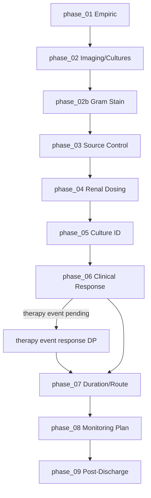
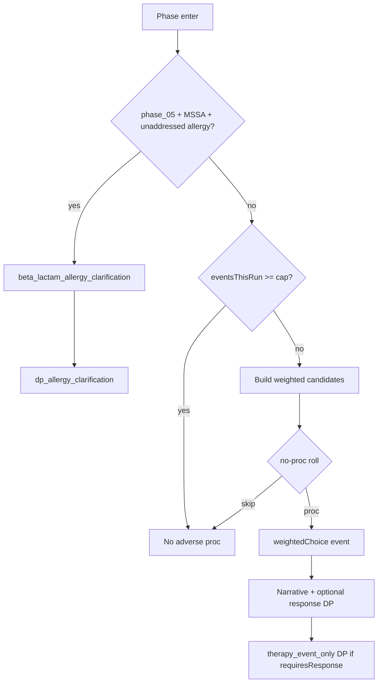

# Bone Deep Decision Map

Internal QA and balancing reference for **Bone Deep** (`scenario_01`). Not shown to players.

## Simulation guardrails

- Active gameplay uses clinical consequence language only — no correct/wrong/optimal/unsafe labels in UI.
- Hidden scores, weights, and outcome tiers appear in this document and debrief logic only.
- `organismRevealed` gates MSSA sprite and organism-specific labels in arena UI.

---

## Phase overview

| Index | Phase ID | Label | Decision | Info-only |
|------:|----------|-------|----------|-----------|
| 0 | `phase_01` | T=0 — Admission | `dp_01_empiric_regimen` | |
| 1 | `phase_02` | T=12h — Imaging & Cultures | — | ✓ |
| 2 | `phase_02b` | T=18h — Preliminary Microbiology | `dp_gram_stain_response` | |
| 3 | `phase_03` | T=24h — Source Control | `dp_source_control` | |
| 4 | `phase_04` | T=36h — Renal Dosing | `dp_02_dose_reassessment` | |
| 5 | `phase_05` | T=48h — Culture Reveal | `dp_03_deescalation`; `dp_allergy_clarification` (conditional) | |
| 6 | `phase_06` | T=5–7d — Clinical Response | therapy event response DPs (conditional) | ✓ otherwise |
| 7 | `phase_07` | T=7–10d — Duration & Route | `dp_04_duration_and_transition` | |
| 8 | `phase_08` | Discharge Planning | `dp_05_monitoring_plan` | |
| 9 | `phase_09` | Post-Discharge Course | — | ✓ (weighted outcome) |



---

## Phase 1: Initial Presentation (`phase_01`)

**Available info:** Purulent diabetic foot wound, cultures drawn, CKD 3b, penicillin allergy (childhood rash), hemodynamic instability.

**Player options:** `dp_01_empiric_regimen` — 7 empiric regimens (vanco+pip, vanco+cefepime, vanco mono, dapto+cefepime, cefazolin mono, meropenem+vanco, linezolid mono).

**Hidden state:** Sets `activeTherapy`, `spectrumBurden`, `toxicityBurden`, `renalRisk`, `patientStability`, stewardship domains.

**Sprites:** `idDoc` advisor; patient generic; no organism sprite.

| Option | Hidden effects (summary) | Clinical consequence | Later risks |
|--------|--------------------------|----------------------|-------------|
| `opt_vanco_pip` | High toxicity/renal risk | Broad empiric coverage | AKI, nephrotoxicity pending |
| `opt_vanco_cefepime` | Moderate toxicity | Balanced empiric coverage | Renal dose adjustment needed |
| `opt_vanco_mono` | Incomplete GN coverage | Gram-positive focus only | Polymicrobial gap |
| `opt_dapto_cefepime` | CK monitoring flag | Alternative gram-positive | Dapto toxicity roll in phase_06 |
| `opt_cefazolin_mono` | No MRSA coverage, ↑ burden | Narrow empiric | Bacteremia delay |
| `opt_meropenem_vanco` | Excessive spectrum | Carbapenem overuse | Stewardship penalty |
| `opt_linezolid_mono` | Bacteriostatic, no GN | Inadequate bacteremia mono | Critical flag possible |

---

## Phase 2: Imaging & Cultures (`phase_02`)

**Available info:** MRI osteomyelitis + abscess; blood cultures positive; SCr 2.3.

**Player options:** Continue only (info-only).

**Hidden state on advance:** `bacteremiaStatus = positive_confirmed`; mild clinical improvement if on therapy.

**Sprites:** `labTech`; culture pending visual (no organism sprite).

---

## Phase 3: Preliminary Microbiology / Gram Stain (`phase_02b`)

**Available info:** “Gram-positive cocci in clusters. Identification and susceptibilities pending.”

**Player options:** `dp_gram_stain_response`

| Option | Hidden effects | Clinical consequence | Notes |
|--------|----------------|----------------------|-------|
| `gs_continue_empiric` | +stability 2 | Acknowledge Gram stain | Baseline path |
| `gs_reinforce_gram_positive` | +stability 3, +tox 1 | Reassess GP coverage | Flag: gram_positive_reassessment |
| `gs_repeat_cultures` | +stability 2 | Repeat cultures ordered | Monitoring emphasis |
| `gs_reassess_source` | +stability 4, relapse −8 | Source control prioritized | Stewardship source_control +8 |
| `gs_monitor_renal_tox` | renalDoseAdjusted, tox −1 | Enhanced monitoring | Safety/monitoring domains |

**Hidden state on advance:** `gramStainRevealed = true`.

**Sprites:** `labTech`; organism status “GP cocci — ID pending”; **no MSSA sprite**.

---

## Phase 4: Source Control (`phase_03`)

**Available info:** Persistent drainage; podiatry available.

| Option | Hidden effects | Clinical consequence | Later risks |
|--------|----------------|----------------------|-------------|
| `sc_prompt_debridement` | scheduled, pending debridement | Debridement scheduled | Completes on advance |
| `sc_urgent_or` | completed, clearing bacteremia | Immediate source control | Best relapse reduction |
| `sc_delay_medical` | delayed, ↑ burden | Source deferred | Abscess persists pending |
| `sc_conservative_wound_care` | inadequate, critical | No surgical consult | Worsening sepsis risk |

**Sprites:** No dedicated advisor; patient declining if unstable.

---

## Phase 5: Renal Dosing (`phase_04`)

**Available info:** SCr 2.3, CrCl ~22; options filtered by `activeTherapy`.

Key options adjust vancomycin interval, hold/redose, switch dapto, reduce cefepime/pip-tazo, adjust dapto q48h, or no change (triggers `aki_event` pending).

**Sprites:** `pharmacist` advisor.

---

## Phase 6: Culture Identification (`phase_05`)

**Available info:** Full culture + susceptibilities; MSSA revealed in chart data.

**Hidden state on advance:** `organismRevealed = true`, `organismIdentity = MSSA`, `susceptibilityRevealed = true`.

**Player options:** `dp_03_deescalation` — cefazolin, nafcillin, oxacillin, continue vanco, linezolid, TMP-SMX, etc.

**Conditional therapy event:** `dp_allergy_clarification` may appear when MSSA is revealed and allergy history is unaddressed. Allergy reconciliation here supports later beta-lactam use but does not replace `dp_03_deescalation` scoring (`deescalationScore` is set only by definitive-therapy choices in that decision).

**Sprites:** `labTech`; **MSSA sprite allowed** after this phase advance.

---

---

## Therapy event framework (`therapyEvents.js`)

Reusable clinical therapy-event system for Bone Deep. Events **proc** (trigger) based on active therapy, phase timing, renal function, toxicity burden, monitoring, source control, duration, and prior flags. Player is graded only on responses to events that actually occurred (`noProcPenalty: true` on all events).

### State model

```javascript
therapyEventState: {
  eligibleEvents: [],
  triggeredEvents: [],
  resolvedEvents: [],
  unresolvedEvents: [],
  eventResponses: {},
  eventsThisRun: 0,
}
```

Each triggered record: `id`, `label`, `phaseId`, `severity`, `narrative`, `requiresResponse`, `resolved`, `mishandled`, `responseDecisionId`, `triggeredAtHours`, `responseId`.

### Frequency guard

| Guard | Value |
|-------|------:|
| `MAX_THERAPY_EVENTS_PER_RUN` | 2 (adverse events) |
| `MAX_THERAPY_EVENTS_HIGH_RISK` | 3 when toxicity ≥8, unadjusted renal dosing with Cr ≥2.2, or `critical_no_monitoring_plan` |
| Per-phase proc | At most **one** weighted adverse event per phase entry |
| No-proc branch | `noProcWeight = 6` (+3 if zero events yet) vs sum of candidate weights |
| Frequency dampening | After 1 event: ×0.4; after 2: ×0.15 |
| Allergy clarification | Deterministic on `phase_05` when MSSA revealed; **does not** count toward adverse cap |

### Event catalog

| Event ID | User-facing label | Type | Roll phases | Eligibility (summary) |
|----------|-------------------|------|-------------|------------------------|
| `vanco_infusion_reaction` | Vancomycin infusion reaction | toxicity_event | `phase_02b`, `phase_03`, `phase_04` | Vancomycin active; early course (≤48h); not already triggered |
| `cefepime_neurotoxicity` | Cefepime neurotoxicity concern | toxicity_event | `phase_04`, `phase_06` | Cefepime active; Cr ≥2.0 or renal trend worsening |
| `dapto_ck_toxicity` | Daptomycin toxicity signal | toxicity_event | `phase_06` | Daptomycin active; uses `rollDaptoToxicity` |
| `beta_lactam_allergy_clarification` | Beta-lactam allergy clarification | stewardship_opportunity | `phase_05` (deterministic) | MSSA revealed; allergy not yet clarified/avoided |

### Relative weights (adverse events only)

Weights are multiplied by frequency dampening before the no-proc roll.

**Vancomycin infusion reaction** — base `1.2` × modifiers:
- toxicityBurden ≥6 → ×1.5
- not renal-adjusted and Cr ≥2.0 → ×1.3
- scenarioTimeHours ≤24 → ×1.2

**Severity branches** (after proc):

| Branch | Weight | requiresResponse |
|--------|-------:|:----------------:|
| mild flushing/pruritus, stable vitals | 5 | no |
| moderate — pause infusion | 2 (×1.5 if tox ≥6) | **yes** → `dp_vanco_infusion_response` |
| severe — chest tightness, evaluation | 0.4 | **yes** |

**Cefepime neurotoxicity** — base `1.0` × modifiers:
- `renalDoseAdjusted` → ×0.25 (strong suppression when correctly adjusted)
- not `renalDoseAdjusted` → ×2.2
- Cr ≥2.2 → ×1.5
- scenarioTimeHours ≥36 → ×1.3
- toxicityBurden ≥6 → ×1.2

Always moderate severity with response DP `dp_cefepime_neuro_response`.

**Daptomycin CK** — candidate weight `2.0` × dampening; internal roll uses existing `rollDaptoToxicity` table (see below). Mild CK: 50% chance to proc without response.

### Response decision points (only when event triggers)

| Event | Decision ID | Mishandled responses (post-discharge / debrief) |
|-------|-------------|--------------------------------------------------|
| Vanco infusion | `dp_vanco_infusion_response` | `vanco_continue_unchanged` |
| Cefepime neuro | `dp_cefepime_neuro_response` | `cefepime_continue_unchanged` |
| Allergy clarification | `dp_allergy_clarification` | `allergy_avoid_all_beta_lactams` |
| Daptomycin CK | `dp_dapto_toxicity_response` | `dapto_resp_continue_monitor` (when severe tier) |

#### Allergy clarification scoring note (post-review)

`allergy_proceed_cefazolin` is allergy **reconciliation**, not MSSA de-escalation:

| Field | `allergy_proceed_cefazolin` effect |
|-------|-----------------------------------|
| `allergyStewardship` | `clarified_low_risk` |
| `betaLactamAccess` | `available` |
| `toxicityBurden` | −2 |
| `stewardship.deescalation` (domain) | +5 (reconciliation credit; capped so this event cannot max the domain alone) |
| `deescalationScore` | **not set** — owned by `dp_03_deescalation` |
| Definitive MSSA therapy | Still chosen separately in `dp_03_deescalation` |

### Hidden effects (response summary)

**Vanco infusion:** appropriate pause/slow/document → stability +2, tox −1; continue unchanged → tox +3, stability −4, discharge −8.

**Cefepime neuro:** adjust/hold/switch → renal adjust or switch; continue unchanged → tox +4, stability −8, discharge −12, relapse +10.

**Allergy clarification (`allergy_proceed_cefazolin`):** documents low-risk allergy reconciliation (`allergyStewardship: clarified_low_risk`, `betaLactamAccess: available`), `toxicityBurden −2`, and contributes **`stewardship.deescalation` +5** only. Does **not** set `deescalationScore` and does **not** substitute for the later MSSA de-escalation decision (`dp_03_deescalation`) — full de-escalation credit still requires an appropriate definitive-therapy choice there. Avoid all beta-lactams → stewardship loss, `toxicityBurden +2`.

### Post-discharge hooks (`getPostDischargeEventModifiers`)

| Trigger / mishandling | Modifier |
|-----------------------|----------|
| Unresolved/mishandled cefepime neuro | `rehabBoost +3`, `confusionBoost +4` |
| Well-managed cefepime neuro | `rehabBoost −1` |
| Mishandled vanco infusion | `therapyDisruption +3` |
| Permanent vanco stop after infusion reaction | `therapyDisruption +2` |
| Allergy → proceed cefazolin | `resolvedBoost +2` |
| Allergy → avoid all beta-lactams | `therapyDisruption +2` |
| Unresolved/mishandled daptomycin CK | `rehabBoost +2`, `confusionBoost +1` |

Applied in `buildOutcomeWeights` to `rehab_monitoring`, `followup_failure`, `resolved_completed`, `severe_deterioration`.

### Debrief

`buildTherapyEventDebriefEntries` lists only triggered events with narrative, player response, impact summary, and expert teaching. No penalty for events that never proc’d. Terminology note for vanco: may mention "red man syndrome" in debrief only.

### No-proc / no-penalty rule

- Events not in `triggeredEvents` → no response DP, no missed-opportunity text, no score penalty.
- `noProcPenalty: true` on all `EVENT_META` entries.
- Stewardship tier unsafe requires player-driven harm, not random event occurrence alone.



---

## Phase 7: Clinical Response (`phase_06`)

**Available info:** Repeat cultures, wound status, renal trend.

**Weighted variability (on phase advance via `processTherapyEventsOnPhaseEnter`):**

Adverse events (vanco infusion, cefepime neuro, daptomycin CK) compete in a single weighted roll per phase. See **Therapy event framework** above.

Legacy renal variability (`rollVancomycinRenalVariability`) still runs separately when vanco active.

## Daptomycin Toxicity Branch (integrated therapy event)

**Trigger:** `dapto_ck_toxicity` event via `processTherapyEventsOnPhaseEnter` at `phase_06` (or mild CK narrative without response ~50% of mild rolls).

**Internal roll (`rollDaptoToxicity`) — only if `daptomycin` in `activeTherapy`**

| Branch | Base weight | Modifiers | requiresResponse |
|--------|------------:|-----------|------------------|
| `dapto_ck_stable` | 4 | — | no |
| `dapto_ck_mild` | 3 | × renalWeight (1–3) | no (50% proc without DP) |
| `dapto_ck_moderate` | 2 | × toxicityWeight × prolonged | **yes** → `daptoToxicityPending` |
| `dapto_ck_severe` | 1 | × renalWeight × toxicityWeight | **yes** |

`renalWeight`: Cr ≥2.2 → 3, ≥1.9 → 2, else 1.  
`toxicityWeight`: toxicityBurden ≥6 → 2, else 1.  
`prolonged`: scenarioTimeHours ≥120 → 2, else 1.

**Risk modifiers:** ↑ creatinine, ↑ toxicityBurden, prolonged course (≥120h).

**Response options (`dp_dapto_toxicity_response`):**

| Option | Effect summary |
|--------|----------------|
| `dapto_resp_continue_monitor` | +tox burden, intensified CK monitoring |
| `dapto_resp_hold_recheck_ck` | Hold dose, stability +1 |
| `dapto_resp_switch_cefazolin` | Replace with cefazolin, de-escalation +9, clears pending |
| `dapto_resp_switch_vancomycin` | Replace with vanco |
| `dapto_resp_hold_switch_beta_lactam` | Cefazolin after allergy reconciliation |

**If ignored:** Phase blocks on pending therapy event until player selects response (`getPendingTherapyEventDecisionId` in PhaseEngine).

**Sprites:** `pharmacistDesk` for daptomycin CK; `pharmacist` for vanco/cefepime toxicity; `scribe5` for allergy clarification.

### Vancomycin renal roll (`rollVancomycinRenalVariability`) — if vanco active

| Branch | Weight if dose-adjusted | Weight if not adjusted |
|--------|------------------------:|-----------------------:|
| stable | 5 | 2 |
| SCR rise | 2 | 4 |
| subtherapeutic | 1 | 2 |

---

## Phase 8: Duration & Route (`phase_07`)

**Dalbavancin eligibility (`isDalbavancinEligible`):**

- `dalbavancinOffered` flag set at phase_07 advance when: source control completed AND bacteremia cleared AND stability ≥50 AND MSSA; OR
- `requires_simulation_flag: dalbavancinOffered` on `dp04_dalbavancin_weekly`.

**Sprites:** `pharmacistDesk`.

---

## Phase 9: Monitoring Plan (`phase_08`)

Multi-select `dp_05_monitoring_plan` — sets `opatReadiness`, `dischargeReadiness`, `relapseRisk`, monitoring score.

**Sprites:** `pharmacist`.

---

## Post-Discharge Outcomes (`phase_09`)

Resolved by `resolvePostDischargeOutcome` (weighted).

| Outcome | Requirements / risk profile | Weight logic (summary) | Narrative endpoint |
|---------|----------------------------|------------------------|-------------------|
| `resolved_completed` | Good source control, active therapy, infection controlled | High when recovery high + duration ≥7; **suppressed** if source incomplete, no therapy, or high burden | Therapy completed, PICC removed |
| `rehab_monitoring` | Moderate OPAT readiness | Base 3 + low OPAT bonus | Rehab transfer |
| `readmission_infection` | High relapse, poor source/duration | relapse×8 + poorSource×6 + poorDuration×5 | Fever, positive cultures |
| `followup_failure` | Poor monitoring plan | +4 if `critical_no_monitoring_plan` | Missed follow-up, ED return |
| `line_complication` | Line/OPAT risk | lineRisk×6 + vanco bonus | Line site infection → unlocks linked scenario |
| `severe_deterioration` | High mortality + poor course | mortality×4 + poorTox×2 − recovery×3 | Septic shock / MODS |

**Guard (2026-07):** `resolved_completed` weight reduced when source not completed, no active therapy, or `infectionBurden ≥45`.

**Sprites:** `scribe5` advisor; patient improved/declining by outcome.

---

## Sprite usage by phase/event

| Phase / event | Sprite key | Organism visual |
|---------------|------------|-----------------|
| phase_01 | `idDoc` | None |
| phase_02 | `labTech` | Pending |
| phase_02b | `labTech` | Gram stain only (no MSSA) |
| phase_03 | — | Pending |
| phase_04 | `pharmacist` | Pending |
| phase_05+ | `labTech` / arena | MSSA after `organismRevealed` |
| Therapy events | `pharmacist` / `pharmacistDesk` / `scribe5` | Per event type |
| Debrief | `stewardshipLead` | Teaching only |

---

## Order flow (UI)

1. Player selects option → **Place Order**
2. **Order Review** — confirm or change (no time advance)
3. **Confirm / Advance Case Clock** → 5s loading screen
4. Decision applied + **phase auto-advances** → next phase `ClinicalPhaseLayout` (no post-loading “order acknowledged” screen)

`therapy_event_only` decision points (infusion reaction, neurotoxicity, allergy clarification, daptomycin CK) apply on confirm **without** advancing the phase, so the phase’s primary decision (e.g. `dp_03_deescalation`) can still be completed on the same clock stop.

Info-only phases: **Continue** → optional transition card → next phase.

---

## Phase layout (`ClinicalPhaseLayout`)

Active gameplay sections (top to bottom):

1. Phase header (time label, progress)
2. Advisor panel (when relevant)
3. **Situation Snapshot** — 2–4 high-yield bullets
4. **What Changed Since Last Update** — prefixed with “New:”
5. **Active Concerns** — chips (bacteremia, CKD, source control, etc.)
6. Active therapy summary
7. Expandable details (Infection Arena dashboard)
8. Decision prompt + cards

---

## Debrief model (process vs outcome)

Final screen separates three axes (not shown during gameplay):

| Axis | Labels | Driven by |
|------|--------|-----------|
| **Stewardship Performance** | Excellent / Strong / Adequate / Concerning / Unsafe | Domain scores, critical flags, unsafe decision IDs — **not** post-discharge RNG alone |
| **Patient Outcome** | Resolved / Complex Recovery / Readmitted / ICU Transfer / Death | `postDischargeOutcomeId`, relapse, mortality |
| **Outcome Attribution** | Mostly decision-driven / Mixed / Mostly clinical variability | Compares monitoring plan strength vs post-discharge event type |

**Unsafe stewardship** requires player-driven harm: no monitoring plan, inadequate source control, ignored toxicity, insufficient duration, linezolid bacteremia, mishandled therapy events, etc.

**Clinical variability attribution** when `monitoring >= 7`, no `critical_no_monitoring_plan`, and outcome is `followup_failure` or `line_complication` with Strong/Excellent stewardship.

---

## Post-Discharge weight adjustments (2026-07)

| Outcome | Weight logic changes |
|---------|---------------------|
| `followup_failure` | ×0.35 when monitoring plan strong; +5 when `critical_no_monitoring_plan` |
| `line_complication` | ×0.2 without OPAT/IV line exposure; ×0.45 when monitoring strong; ×0.25 with dalbavancin |
| `severe_deterioration` | ×0.15 when source OK, infection controlled, monitoring strong, recovery >0.65 |
| `resolved_completed` | Requires source OK + active therapy + infection controlled; `resolvedBoost` from allergy clarification |

### Therapy-event post-discharge modifiers (2026-07)

See **Therapy event framework → Post-discharge hooks**. Unresolved cefepime neuro → rehab/confusion; mishandled vanco infusion → therapy disruption; well-handled allergy clarification → smoother resolution weight.

---

## Order flow (legacy note)

_Removed: post-loading ClinicalUpdatePanel “Order acknowledged” step._

---

## Playtest / tuning pass (2026-07)

See **[docs/bone-deep-playtest-matrix.md](bone-deep-playtest-matrix.md)** for QA paths and expected tiers.

### Therapy event frequency (tuned)

| Knob | Before | After |
|------|--------|-------|
| Vanco infusion base weight | 1.5 | 1.2 |
| Daptomycin candidate weight | 2.5 | 2.0 |
| Cefepime neuro (renal adjusted) | ×2.5 if not adjusted only | ×0.25 if adjusted; ×2.2 if not |
| No-proc branch weight | 4 (+2 if zero events) | 6 (+3 if zero events) |

Target remains 0–1 adverse events in most runs; `npm run verify:bone-deep` includes seeded frequency smoke tests.

### Scoring coherence (tuned)

- `computeStewardshipTier`: low dimension average without unsafe decision IDs now returns **Concerning**, not **Unsafe** (RNG/low coverage alone should not label strong play Unsafe).
- `followup_failure` weight: +6 when `critical_no_monitoring_plan` (was +5 additive in builder).
- `severe_deterioration` dampening when course strong: ×0.12 (was ×0.15).

### Post-discharge narratives

`resolvePostDischargeOutcome` builds **2–3 clinical beats** per outcome from hidden state (OPAT line exposure, source control, etc.). UI renders beats as bullets in phase_09 and debrief.

### Flow verification

- `therapy_event_only` confirms without phase advance (PhaseEngine).
- Automated: `regimen-arena/scripts/verify-bone-deep-flow.mjs`, `verify-therapy-events.mjs`, `verify-allergy-scoring.mjs` via `npm run verify:bone-deep`.

---

## Known TODOs / clinical assumptions

- Penicillin allergy low-risk phenotype assumed for cefazolin pathways; `dp_allergy_clarification` documents reconciliation but does not replace `dp_03_deescalation` for `deescalationScore`.
- Dalbavancin offered as selected OPAT alternative — not universally appropriate; gated in UI.
- Gram stain phase does not change organism identity early — final ID still at phase_05.
- Case briefings (`caseBriefings.js`) may be out of phase sync — arena uses `arenaStageMeta` + simulation projection.
- `decisionPoints.json` `outcome` and `feedback` fields are debrief/scoring references; not shown during active gameplay in simulation mode.
