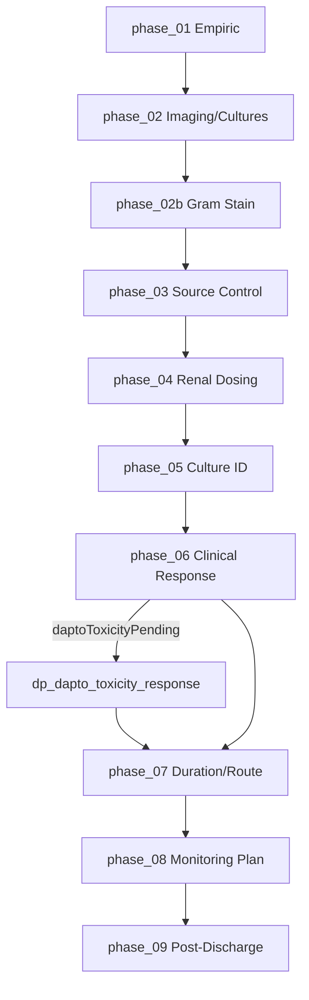

# Bone Deep Decision Map

Internal QA and balancing reference for **Bone Deep** (`scenario_01`). Not shown to players.

## Simulation guardrails

- Active gameplay uses clinical consequence language only — no correct/wrong/optimal/unsafe labels in UI.
- Hidden scores, weights, and outcome tiers appear in this document and debrief logic only.
- `organismRevealed` gates MSSA sprite and organism-specific labels in arena UI.

---

## Phase overview

| Index | Phase ID | Label | Decision | Info-only |
|------:|----------|-------|----------|-----------|
| 0 | `phase_01` | T=0 — Admission | `dp_01_empiric_regimen` | |
| 1 | `phase_02` | T=12h — Imaging & Cultures | — | ✓ |
| 2 | `phase_02b` | T=18h — Preliminary Microbiology | `dp_gram_stain_response` | |
| 3 | `phase_03` | T=24h — Source Control | `dp_source_control` | |
| 4 | `phase_04` | T=36h — Renal Dosing | `dp_02_dose_reassessment` | |
| 5 | `phase_05` | T=48h — Culture Reveal | `dp_03_deescalation` | |
| 6 | `phase_06` | T=5–7d — Clinical Response | `dp_dapto_toxicity_response` (conditional) | ✓ otherwise |
| 7 | `phase_07` | T=7–10d — Duration & Route | `dp_04_duration_and_transition` | |
| 8 | `phase_08` | Discharge Planning | `dp_05_monitoring_plan` | |
| 9 | `phase_09` | Post-Discharge Course | — | ✓ (weighted outcome) |

---

## Phase 1: Initial Presentation (`phase_01`)

**Available info:** Purulent diabetic foot wound, cultures drawn, CKD 3b, penicillin allergy (childhood rash), hemodynamic instability.

**Player options:** `dp_01_empiric_regimen` — 7 empiric regimens (vanco+pip, vanco+cefepime, vanco mono, dapto+cefepime, cefazolin mono, meropenem+vanco, linezolid mono).

**Hidden state:** Sets `activeTherapy`, `spectrumBurden`, `toxicityBurden`, `renalRisk`, `patientStability`, stewardship domains.

**Sprites:** `idDoc` advisor; patient generic; no organism sprite.

| Option | Hidden effects (summary) | Clinical consequence | Later risks |
|--------|--------------------------|----------------------|-------------|
| `opt_vanco_pip` | High toxicity/renal risk | Broad empiric coverage | AKI, nephrotoxicity pending |
| `opt_vanco_cefepime` | Moderate toxicity | Balanced empiric coverage | Renal dose adjustment needed |
| `opt_vanco_mono` | Incomplete GN coverage | Gram-positive focus only | Polymicrobial gap |
| `opt_dapto_cefepime` | CK monitoring flag | Alternative gram-positive | Dapto toxicity roll in phase_06 |
| `opt_cefazolin_mono` | No MRSA coverage, ↑ burden | Narrow empiric | Bacteremia delay |
| `opt_meropenem_vanco` | Excessive spectrum | Carbapenem overuse | Stewardship penalty |
| `opt_linezolid_mono` | Bacteriostatic, no GN | Inadequate bacteremia mono | Critical flag possible |

---

## Phase 2: Imaging & Cultures (`phase_02`)

**Available info:** MRI osteomyelitis + abscess; blood cultures positive; SCr 2.3.

**Player options:** Continue only (info-only).

**Hidden state on advance:** `bacteremiaStatus = positive_confirmed`; mild clinical improvement if on therapy.

**Sprites:** `labTech`; culture pending visual (no organism sprite).

---

## Phase 3: Preliminary Microbiology / Gram Stain (`phase_02b`)

**Available info:** “Gram-positive cocci in clusters. Identification and susceptibilities pending.”

**Player options:** `dp_gram_stain_response`

| Option | Hidden effects | Clinical consequence | Notes |
|--------|----------------|----------------------|-------|
| `gs_continue_empiric` | +stability 2 | Acknowledge Gram stain | Baseline path |
| `gs_reinforce_gram_positive` | +stability 3, +tox 1 | Reassess GP coverage | Flag: gram_positive_reassessment |
| `gs_repeat_cultures` | +stability 2 | Repeat cultures ordered | Monitoring emphasis |
| `gs_reassess_source` | +stability 4, relapse −8 | Source control prioritized | Stewardship source_control +8 |
| `gs_monitor_renal_tox` | renalDoseAdjusted, tox −1 | Enhanced monitoring | Safety/monitoring domains |

**Hidden state on advance:** `gramStainRevealed = true`.

**Sprites:** `labTech`; organism status “GP cocci — ID pending”; **no MSSA sprite**.

---

## Phase 4: Source Control (`phase_03`)

**Available info:** Persistent drainage; podiatry available.

| Option | Hidden effects | Clinical consequence | Later risks |
|--------|----------------|----------------------|-------------|
| `sc_prompt_debridement` | scheduled, pending debridement | Debridement scheduled | Completes on advance |
| `sc_urgent_or` | completed, clearing bacteremia | Immediate source control | Best relapse reduction |
| `sc_delay_medical` | delayed, ↑ burden | Source deferred | Abscess persists pending |
| `sc_conservative_wound_care` | inadequate, critical | No surgical consult | Worsening sepsis risk |

**Sprites:** No dedicated advisor; patient declining if unstable.

---

## Phase 5: Renal Dosing (`phase_04`)

**Available info:** SCr 2.3, CrCl ~22; options filtered by `activeTherapy`.

Key options adjust vancomycin interval, hold/redose, switch dapto, reduce cefepime/pip-tazo, adjust dapto q48h, or no change (triggers `aki_event` pending).

**Sprites:** `pharmacist` advisor.

---

## Phase 6: Culture Identification (`phase_05`)

**Available info:** Full culture + susceptibilities; MSSA revealed in chart data.

**Hidden state on advance:** `organismRevealed = true`, `organismIdentity = MSSA`, `susceptibilityRevealed = true`.

**Player options:** `dp_03_deescalation` — cefazolin, nafcillin, oxacillin, continue vanco, linezolid, TMP-SMX, etc.

**Sprites:** `labTech`; **MSSA sprite allowed** after this phase advance.

---

## Phase 7: Clinical Response (`phase_06`)

**Available info:** Repeat cultures, wound status, renal trend.

**Weighted variability (on phase advance):**

### Daptomycin CK roll (`rollDaptoToxicity`) — only if `daptomycin` in `activeTherapy`

| Branch | Base weight | Modifiers | requiresResponse |
|--------|------------:|-----------|------------------|
| `dapto_ck_stable` | 4 | — | no |
| `dapto_ck_mild` | 3 | × renalWeight (1–3) | no |
| `dapto_ck_moderate` | 2 | × toxicityWeight × prolonged | **yes** → `daptoToxicityPending` |
| `dapto_ck_severe` | 1 | × renalWeight × toxicityWeight | **yes** |

`renalWeight`: Cr ≥2.2 → 3, ≥1.9 → 2, else 1.  
`toxicityWeight`: toxicityBurden ≥6 → 2, else 1.  
`prolonged`: scenarioTimeHours ≥120 → 2, else 1.

### Vancomycin renal roll (`rollVancomycinRenalVariability`) — if vanco active

| Branch | Weight if dose-adjusted | Weight if not adjusted |
|--------|------------------------:|-----------------------:|
| stable | 5 | 2 |
| SCR rise | 2 | 4 |
| subtherapeutic | 1 | 2 |

**Sprites:** `pharmacistDesk` if dapto toxicity pending; else `labTech` / `pharmacist`.

---

## Daptomycin Toxicity Branch

**Trigger:** `rollDaptoToxicity` returns moderate/severe while on daptomycin at `phase_06` advance.

**Risk modifiers:** ↑ creatinine, ↑ toxicityBurden, prolonged course (≥120h).

**Response options (`dp_dapto_toxicity_response`):**

| Option | Effect summary |
|--------|----------------|
| `dapto_resp_continue_monitor` | +tox burden, intensified CK monitoring |
| `dapto_resp_hold_recheck_ck` | Hold dose, stability +1 |
| `dapto_resp_switch_cefazolin` | Replace with cefazolin, de-escalation +9, clears pending |
| `dapto_resp_switch_vancomycin` | Replace with vanco |
| `dapto_resp_hold_switch_beta_lactam` | Cefazolin after allergy reconciliation |

**If ignored:** Phase blocks on `daptoToxicityPending` until player selects a response (PhaseEngine override).

---

## Phase 8: Duration & Route (`phase_07`)

**Dalbavancin eligibility (`isDalbavancinEligible`):**

- `dalbavancinOffered` flag set at phase_07 advance when: source control completed AND bacteremia cleared AND stability ≥50 AND MSSA; OR
- `requires_simulation_flag: dalbavancinOffered` on `dp04_dalbavancin_weekly`.

**Sprites:** `pharmacistDesk`.

---

## Phase 9: Monitoring Plan (`phase_08`)

Multi-select `dp_05_monitoring_plan` — sets `opatReadiness`, `dischargeReadiness`, `relapseRisk`, monitoring score.

**Sprites:** `pharmacist`.

---

## Post-Discharge Outcomes (`phase_09`)

Resolved by `resolvePostDischargeOutcome` (weighted).

| Outcome | Requirements / risk profile | Weight logic (summary) | Narrative endpoint |
|---------|----------------------------|------------------------|-------------------|
| `resolved_completed` | Good source control, active therapy, infection controlled | High when recovery high + duration ≥7; **suppressed** if source incomplete, no therapy, or high burden | Therapy completed, PICC removed |
| `rehab_monitoring` | Moderate OPAT readiness | Base 3 + low OPAT bonus | Rehab transfer |
| `readmission_infection` | High relapse, poor source/duration | relapse×8 + poorSource×6 + poorDuration×5 | Fever, positive cultures |
| `followup_failure` | Poor monitoring plan | +4 if `critical_no_monitoring_plan` | Missed follow-up, ED return |
| `line_complication` | Line/OPAT risk | lineRisk×6 + vanco bonus | Line site infection → unlocks linked scenario |
| `severe_deterioration` | High mortality + poor course | mortality×4 + poorTox×2 − recovery×3 | Septic shock / MODS |

**Guard (2026-07):** `resolved_completed` weight reduced when source not completed, no active therapy, or `infectionBurden ≥45`.

**Sprites:** `scribe5` advisor; patient improved/declining by outcome.

---

## Sprite usage by phase/event

| Phase / event | Sprite key | Organism visual |
|---------------|------------|-----------------|
| phase_01 | `idDoc` | None |
| phase_02 | `labTech` | Pending |
| phase_02b | `labTech` | Gram stain only (no MSSA) |
| phase_03 | — | Pending |
| phase_04 | `pharmacist` | Pending |
| phase_05+ | `labTech` / arena | MSSA after `organismRevealed` |
| Dapto toxicity | `pharmacistDesk` | MSSA if revealed |
| phase_08 OPAT | `pharmacist` | MSSA |
| phase_09 | `scribe5` | Per outcome variant |
| Debrief | `stewardshipLead` | Teaching only |

---

## Order flow (UI)

1. Player selects option → **Place Order**
2. **Order Review** — confirm or change (no time advance)
3. **Confirm / Advance Case Clock** → 5s loading screen
4. Decision applied → **Clinical Update** panel (no intermediate “order placed” animation with organism leak)

---

## Known TODOs / clinical assumptions

- Penicillin allergy low-risk phenotype assumed for cefazolin pathways; formal allergy reconciliation is narrative-only.
- Dalbavancin offered as selected OPAT alternative — not universally appropriate; gated in UI.
- Gram stain phase does not change organism identity early — final ID still at phase_05.
- Case briefings (`caseBriefings.js`) may be out of phase sync — arena uses `arenaStageMeta` + simulation projection.
- `decisionPoints.json` `outcome` and `feedback` fields are debrief/scoring references; not shown during active gameplay in simulation mode.
